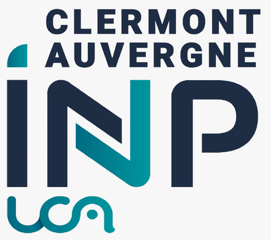

## Journées Scientifiques des Doctorants SPI 2022

Welcome to Journées Scientifiques des Doctorants SPI 2022. This annual meeting is an opportunity to discover the various thesis topics within our doctoral school, to exchange with other PhD students working on the same topics as you (or topics that arouse your curiosity) and, perhaps, to lead to collaborations and/or friendships. Several speakers will be invited during these two days: some of them will present the possible career perspectives after a PhD. We will reveal more about the program soon! The participation of Ph.D students to these two days is mandatory. It is part of the requirement for obtaining your doctoral degree. 

## Pre-Register
We are inviting you to complete the [survey](https://framaforms.org/participation-aux-journees-scientifiques-des-doctorants-1652653658)
as soon as possible (estimated time: 2 minutes) for the pre-registration process. 

## Poster

### Poster printing
We are in charge of printing the posters. The poster must be sent to us **before June 6th**, otherwise you will have to print the poster at your own expense. You may or may not use the [template in latex](A0_Vertical_Template-latex.zip) and [template in PowerPoint](A0_Vertical_Template.pptx) in that were provided in the original email but the format must be **A0**.

You will also have to make a poster which presents your thesis subject and send it to us before June 6, as well as a single slide before June 17  You will find attached the templates (pptx and latex) to create your poster and some examples at this [website]( https://spi.ed.uca.fr/inscription-obligations/obligations/journee-scientifique-de-led-spi) (click on the arrows to view all the posters for a given year).

Mandatory elements on the poster
The poster must indicate the funding organization and the mention "Ecole Doctorale des Sciences pour l'Ingénieur". The logo of Clermont Auvergne INP UCA must also appear (see attachment).

Where to submit the documents
We have created a link where you can submit your posters and presentations: https://drive.uca.fr/u/d/165f51bbf9ec46308243/. We ask you to respect the following nomenclature: pos_LASTNAME_firstname.pdf for the poster and pres_LASTNAME_firstname.pdf for the presentation.

Poster printing
We are in charge of printing the posters: the poster must be sent to us before June 6th, otherwise you will have to print the poster at your own expense. You may or may not use the templates that were provided in the original email, the only condition being that the format is A0.

## Prize???

## Support or Contact

### Contact
jsd-edspi.dred@uca.fr

### FAQ
1.**Mandatory elements on the poster**

The poster must indicate the funding organization and the mention "Ecole Doctorale des Sciences pour l'Ingénieur". The logo of Clermont Auvergne INP UCA must also appear (see attachment).

2.**Poster printing**

We are in charge of printing the posters: the poster must be sent to us before June 6th, otherwise you will have to print the poster at your own expense. You may or may not use the templates that were provided in the original email, the only condition being that the format is A0.

3.**Can I make many slides for the presentation?**

After consultation, we finally decided to allow the possibility of making several slides for the 3 minutes presentation.

4.**I am not in Clermont-Ferrand, can I make my presentation remotely?**

It is strongly recommended to come in person to make your presentation and discuss with other people around your poster. It is also an opportunity to meet other PhD students in a friendly environment and to discover our beautiful region of Clermont-Ferrand! However, the doctoral school does not finance transportation and accommodation costs (unless you are based abroad, in which case you should contact us).

5.**I am in my first year and I do not have any results. Can I still participate?**

Absolutely, we even recommend participating in the first year. Remember that one of the goals of the Scientific Days is to have an overview of the thesis topics within the doctoral school to encourage exchange. You can find examples at the following link to help you make your [Poster](https://spi.ed.uca.fr/inscription-obligations/obligations/journee-scientifique-de-led-spi)

6.**Will there be prizes?**

Many of you have asked us questions about the Scientific Days! Here are some information to complete the original mail:

Website
We have created a website where you will find all the important information about the Scientific Days for PhD students: https://jsd2022.github.io/.

Frequently asked questions:

Can I make many slides for the presentation?
After consultation, we finally decided to allow the possibility of making several slides for the 3 minutes presentation.

I am not in Clermont-Ferrand, can I make my presentation remotely?
It is strongly recommended to come in person to make your presentation and discuss with other people around your poster. It is also an opportunity to meet other PhD students in a friendly environment and to discover our beautiful region of Clermont-Ferrand!
However, the doctoral school does not finance transportation and accommodation costs (unless you are based abroad, in which case you should contact us).

I will not be available on June 21 or 22. What can I do?
You can do your presentation next year (as long as you are still a PhD student!).

I am in my first year and I do not have any results. Can I still participate?
Absolutely, we even recommend participating in the first year. Remember that one of the goals of the Scientific Days is to have an overview of the thesis topics within the doctoral school to encourage exchange. You can find examples at the following link to help you make your poster: https://spi.ed.uca.fr/inscription-obligations/obligations/journee-scientifique-de-led-spi 

Will there be prizes?
Yes! We are planning to give prizes for the best poster and the best presentation. To be eligible for the best presentation prize, you must not exceed 3 minute presentation ;)

Any other questions?
We're always open! You can send us a message at this email address.

