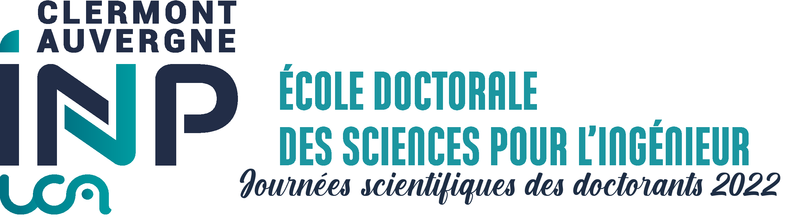

# Journées Scientifiques des Doctorants SPI 2022

Welcome to Journées Scientifiques des Doctorants SPI 2022! This annual meeting is an opportunity to discover the various thesis topics within our doctoral school, to exchange with other PhD students working on the same topics as you (or topics that arouse your curiosity) and, perhaps, to lead to collaborations and/or friendships. Several speakers will be invited during these two days: some of them will present the possible career perspectives after a PhD. We will reveal more about the program soon! 

Note that attending the Scientific Days at least one time is part of the requirement for obtaining your doctoral degree. To this end, you need to prepare a poster and slides for your 3-minute presentation. We strongly encourage you to come to meet the other PhD students and have a broad overview of the research topics within the doctoral school.

## Conference program

The conference program is released. Please check [here](JSD-SPI22_program.pdf) to find the information about your time slot for the presentation and other activities. 

## Important to read

### Dates and Place
June 21st and 22nd 2022, at Pôle Commun

### Pre-Register

We are inviting you to complete the [survey](https://framaforms.org/participation-aux-journees-scientifiques-des-doctorants-1652653658)
as soon as possible (estimated time: 2 minutes) for the pre-registration process. 

### Poster acknowledgements

The poster must indicate **your funding organization** and mention **"Ecole Doctorale des Sciences pour l'Ingénieur"**. The [logo of Clermont Auvergne INP UCA](logo-CA-INP.png) must also appear in your poster.

### Poster and presentation submission

You need to upload the documents [in this link](https://drive.uca.fr/u/d/4d609caa717b421599ef/). Please respect the following nomenclature **pos_LASTNAME_firstname.pdf** for the poster and **pres_LASTNAME_firstname.pdf** for the presentation. The password is in the email we sent you. 

Deadlines:
- posters: **June 6th**
- presentation: Extended to **June 20th**

## Poster preparation

We are in charge of printing the posters. The poster must be sent to us before the deadline, otherwise you will have to print the poster at your own expense. You may or may not use the [template in latex](A0_Vertical_Template-latex.zip) and [template in PowerPoint](A0_Vertical_Template.pptx) but the format must be **A0**. Here are some examples of the poster at this [website](https://spi.ed.uca.fr/inscription-obligations/obligations/journee-scientifique-de-led-spi).

## FAQ

**1. I am not in Clermont-Ferrand, can I make my presentation remotely?**

It is strongly recommended to come in person to make your presentation and discuss with other people around your poster. It is also an opportunity to meet other PhD students in a friendly environment and to discover our beautiful region of Clermont-Ferrand! However, the doctoral school does not finance transportation and accommodation costs (unless you are based abroad, in which case you should contact us).

**2. I will not be available on June 21 or 22. What can I do?**

You can do your presentation next year (as long as you are still a PhD student!).

**3. I am in my first year and I do not have any results. Can I still participate?**

Absolutely, we even recommend participating in the first year. Remember that one of the goals of the Scientific Days is to have an overview of the thesis topics within the doctoral school to encourage exchange.

**4. I am in my third year and I am not able to attend the Scientific Days. What can I do?**

The attendance for you is not compulsory. Please contact Youcef Mezouar (youcef.mezouar@uca.fr) with Dominique Torrisani in copy (dominique.torrisani@uca.fr) to make them aware of your situation.

**5. Can I make many slides for the presentation?**

Yes.

**6. Will there be prizes?**

Yes! We are planning to give prizes for the best poster and the best presentation. To be eligible for the best presentation prize, you must not exceed 3 minute presentation.

## Contact
jsd-edspi.dred@uca.fr

## Organisers 

In alphabetical order name:

- Frédéric A. HAYEK (Ph.D candidate in Cryptology from LIMOS)
- Guillaume FOIN (Ph.D candidate in Energy from Institut Pascal)
- Hélène TRAN (Ph.D candidate in Artificial Intelligence from LIMOS)
- Ivan Luca BRAN COSTA (Ph.D candidate in Information from Institut Pascal)
- Mincui LIANG (Ph.D candidatein Power Electronic from Institut Pascal)

